# Redesign-myNEU
Redesigned myNEU web prototype for IS 4900

## Setup

#### Install Node.js
1. Install [HomeBrew](http://brew.sh/)
1. `brew install nvm`
1. `nvm install v6.9.4`

#### Setting up the Project
1. Install Jekyll `$ gem install jekyll`
1. Install gulp: `$ npm install -g gulp`
1. Install dependencies: `$ npm install`
1. Build for prod: `$ gulp build`
1. For dev: `gulp serve`

## Screenshots
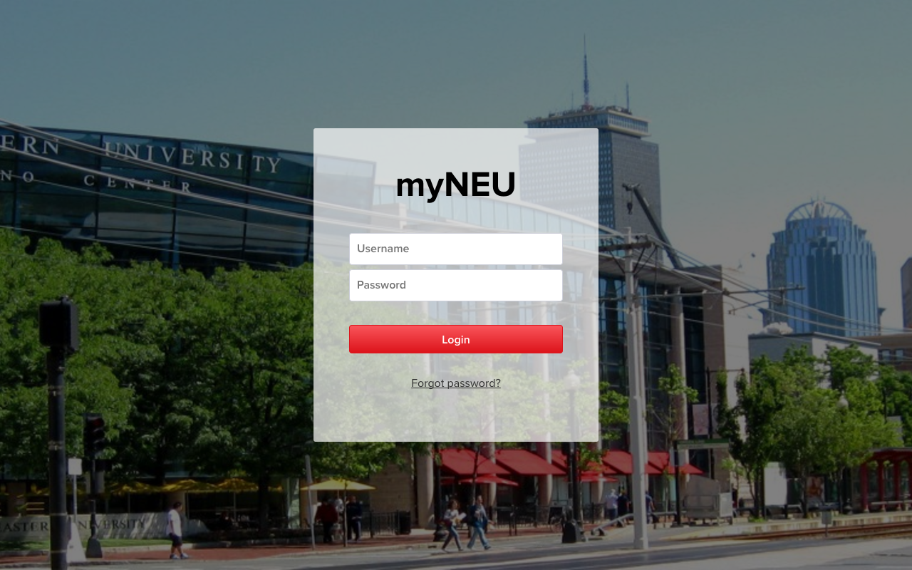
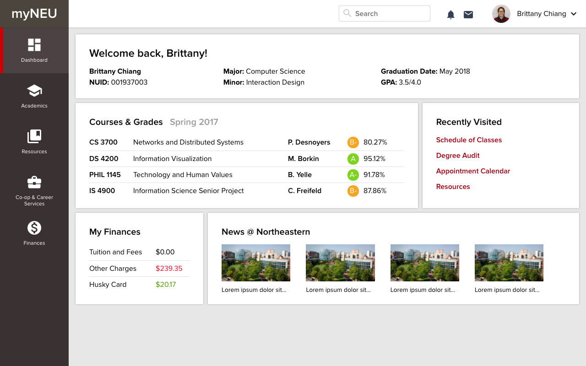
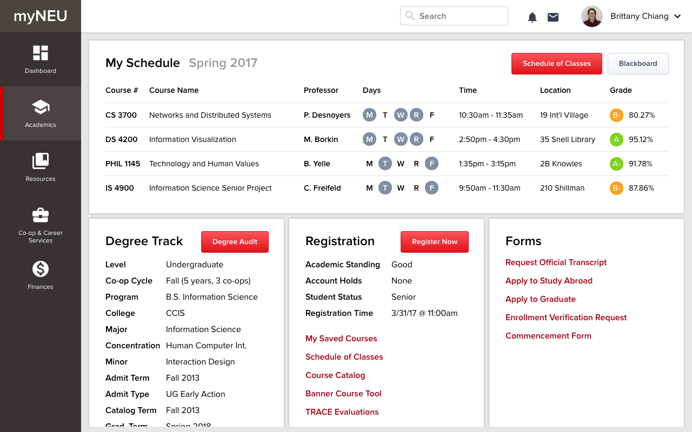
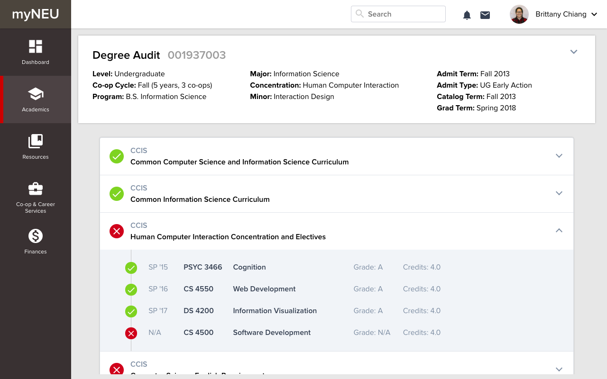
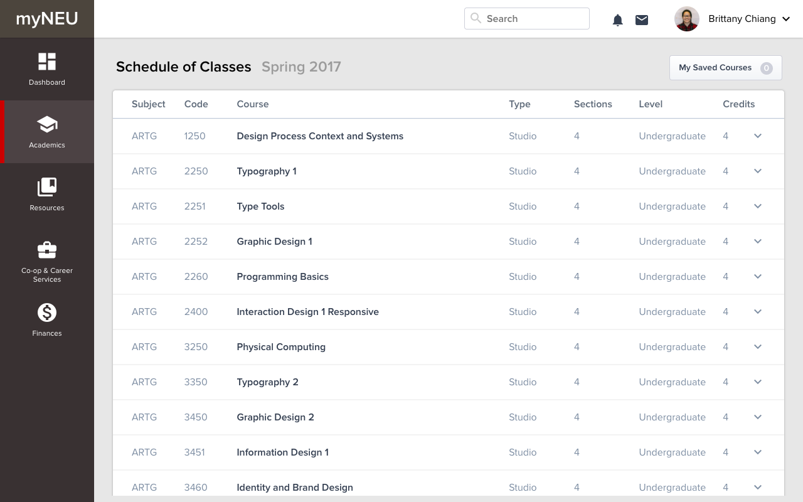
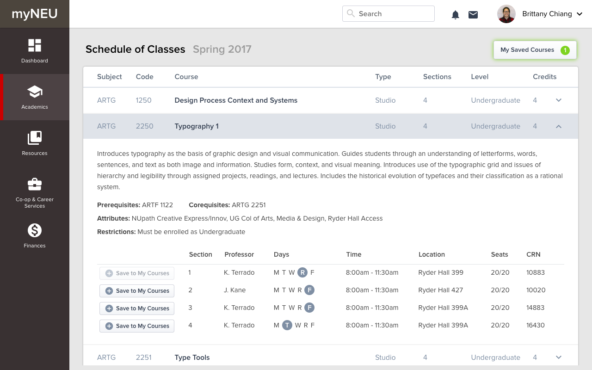
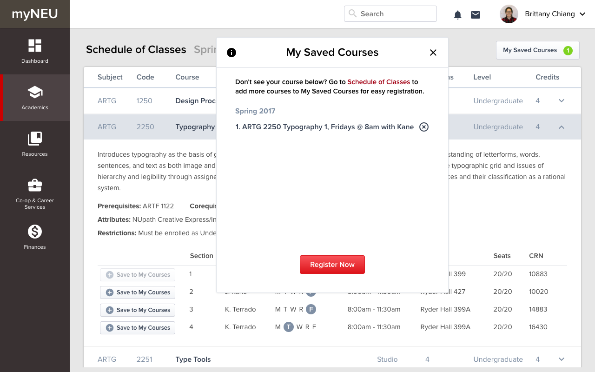
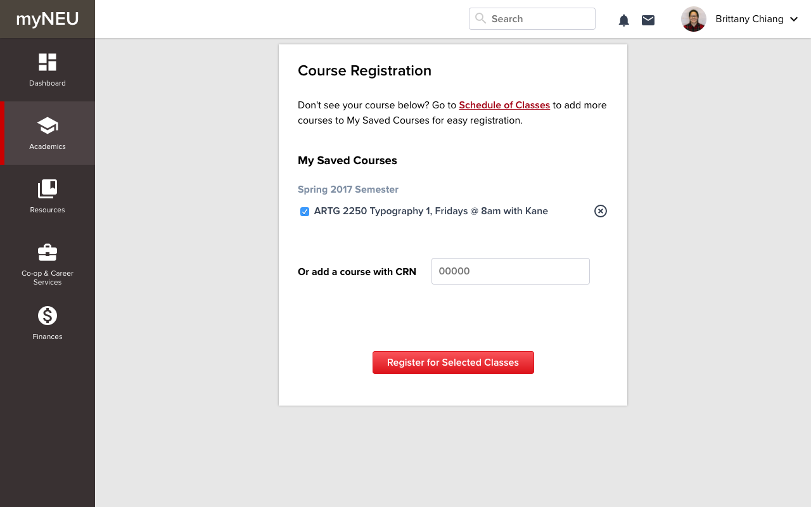
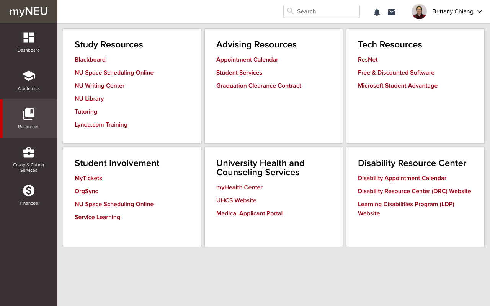
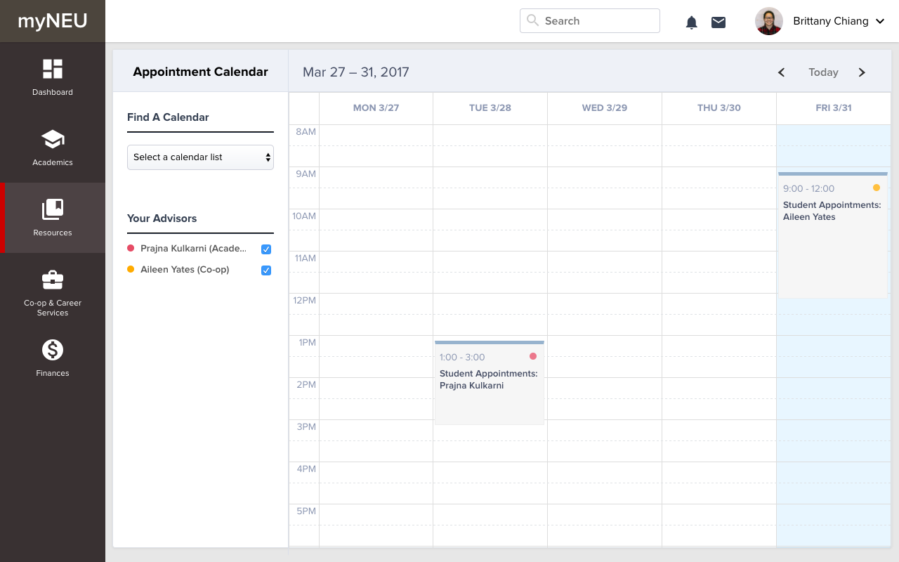
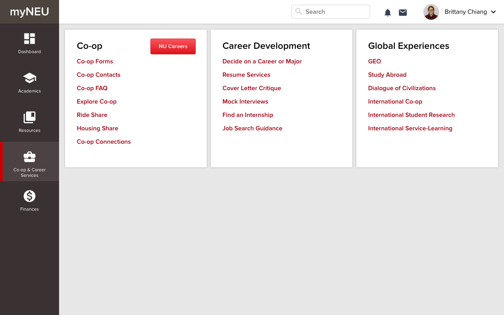
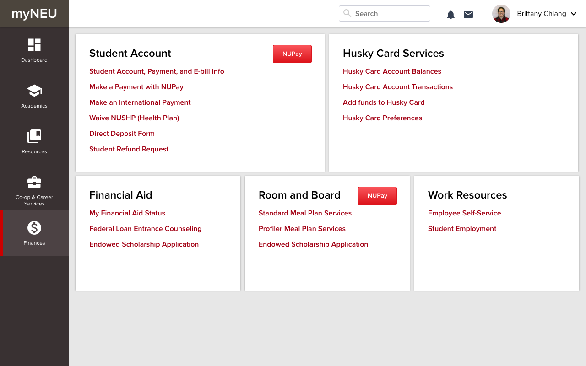